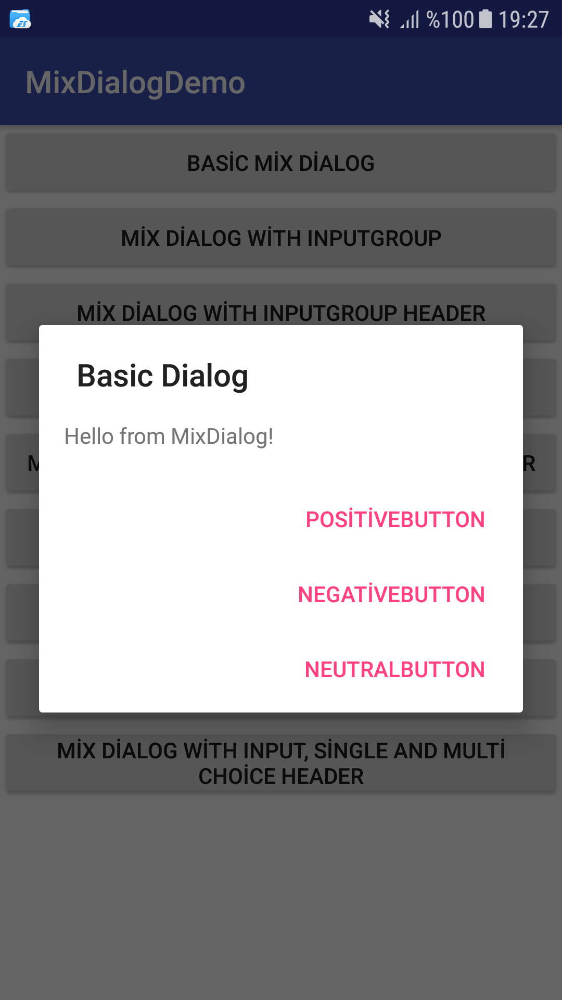
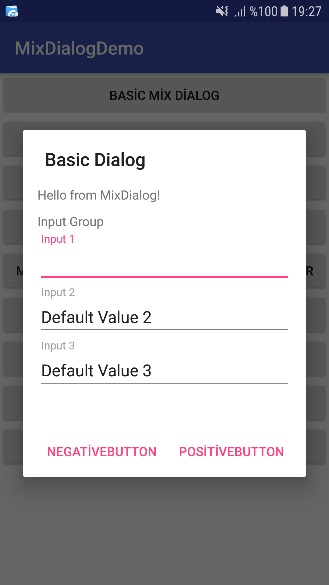
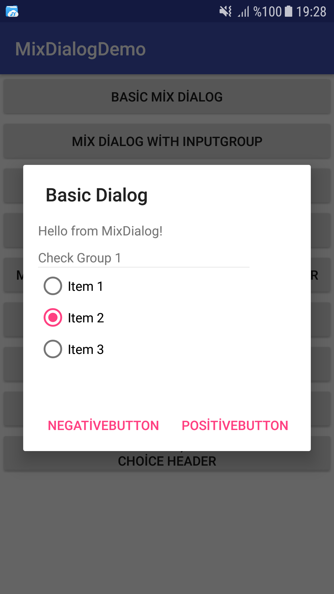
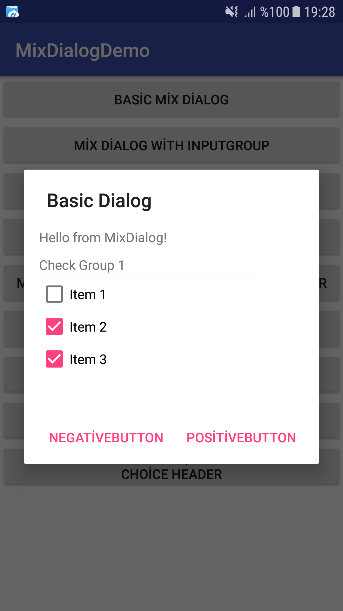
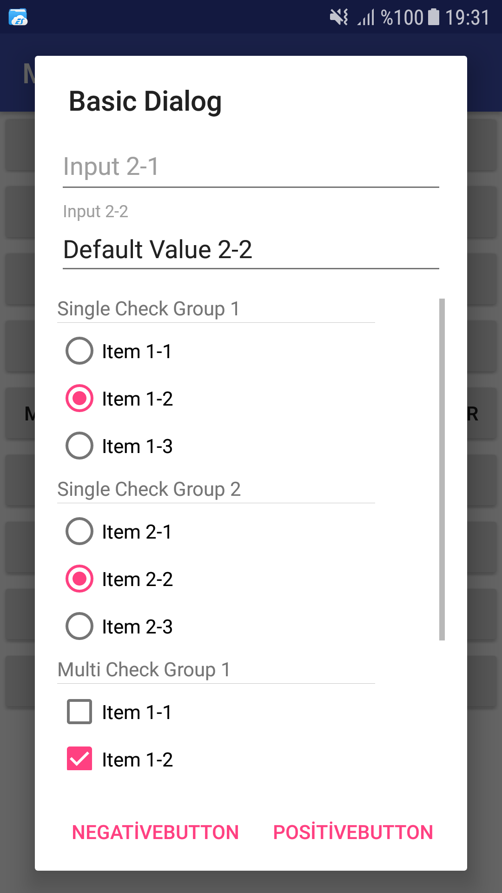

    
[](https://bintray.com/birfincankafein/com.birfincankafein/mixdialog/_latestVersion)  []()  
  What is MixDialog? 
  ------------       
 MixDialog is a dialog utility that allows you to show title text, message text, input areas, single and multi choice items at the same time in the AlertDialog. It has 4 ItemGroup type: `InputItemGroup`, `CheckItemGroup` for single checkable items, `CheckItemGroup` for multiple checkable items and `KeyValueItemGroup` for key-value pair items.   
MixDialog uses EditText inside the TextInputLayout for input groups, RadioButton inside the RadioGroup for single check groups, CheckBox inside the LinearLayout for multiple check groups and TextViews inside LinearLayout for key-value items.  
  
Usage 
-----    
In order to use the library, there are 3 different options:    
    
**1. Gradle dependency**    
    
 -  Add this to your app `build.gradle`:    
 ```gradle 
 dependencies {
	implementation 'com.birfincankafein:mixdialog:2.0.1@aar'  
}
```    
    
**2. Maven**
 - Add the following to the `<dependencies>` section of your `pom.xml`:    
 ```xml 
 <dependency>    
	<groupId>com.birfincankafein</groupId>  
	<artifactId>mixdialog</artifactId>    
	<version>2.0.1</version>  
</dependency> 
```    
    
**3. Ivy**
 - Add the following to the `<dependencies>` section of your `ivy.xml`:  
```xml 
<dependency org='com.birfincankafein' name='mixdialog' rev='2.0.1'> <artifact name='mixdialog' ext='pom' /> </dependency>  
```    
    
How to Use 
-----    
MixDialog and ItemGroups has it's own builder to create an instance. Also, MixDialog can show combinations of these types of values:   
* Title text  
* Message text   
* Positive, Negative and Neutral Buttons  
* Input item groups  
* Single checkable item groups  
* Multiple checkable item groups  
* Key-value paired item groups  
  
#### Title,  Message texts, Buttons and Dialog Event  
You can easily set:  
* title using `setTitle(CharSequence)` or `setTitle(int)`,   
* message using  `setMessage(CharSequence)` or `setMessage(int)`,   
* positive button's text using `setPositiveButtonText(CharSequence)` or `setPositiveButtonText(int)`  
* negative button's text using `setNegativeButtonText(CharSequence)` or `setNegativeButtonText(int)`  
* neutral button's text using `setNeutralButtonText(CharSequence)` or `setNeutralButtonText(int)`  
* and dialog event listener using `setOnDialogEventListener(MixDialog.onDialogEventListener)`.   
  
In the DialogEvent's `onDialogButtonClick` callback, you should return a boolean value: ***true*** for dismiss the dialog after `buttonType` button clicked, ***false*** to prevent dialog from closing.  
```java 
MixDialog mixDialog = new MixDialog.Builder(mContext)    
    .setTitle("Basic Dialog")    
    .setMessage("Hello from MixDialog!")    
    .setPositiveButtonText("PositiveButton")    
    .setNegativeButtonText("NegativeButton")    
    .setNeutralButtonText("NeutralButton")    
    .setCancelable(false)    
    .setOnDialogEventListener(new MixDialog.onDialogEventListener() {    
        @Override    
        public boolean onDialogButtonClick(MixDialog.ButtonType buttonType, MixDialog dialog) {  
			 return true;        
		}    
    })    
	.build().create().show();  
```  
#### KeyValueItemGroup and KeyValueItem  
KeyValueItemGroup is an item group that contains key value pair KeyValueItems. Each KeyValueItemGroup has its own title and will  be shown based on `setShowGroupNameAsHeader(boolean)` method. KeyValueItemGroups can be created using `KeyValueItemGroup.Builder(Context)`. Builder automatically creates `KeyValueItem`s when `addKeyValueItem()` called.  
  
You can add KeyValueItemGroups from `MixDialog.Builder` using  `MixDialog.Builder#addKeyValueItemGroup(KeyValueItemGroup)`. With this method, you need to create KeyValueItemGroup outside of the MixDialog.Builder. Another way to add KeyValueItemGroup from `MixDialog.Builder` is using `MixDialog.Builder#addKeyValueItemGroup(String)`. This method returns  `KeyValueItemGroup.Builder()` that allows you create KeyValueItemGroup and to continue to build MixDialog, you can call `buildWithParent()` from `KeyValueItemGroup.Builder`.  
```java  
MixDialog mixDialog = new MixDialog.Builder(this)  
	... 
	.addKeyValueItemGroup("KeyValue Group 1")
		.setKeyValueWidthRatio(1.5f)
	    .addKeyValueItem("Key 1", "Value 1")  
	    .addKeyValueItem("Key 2", "Value 2")  
	    .addKeyValueItem("Key 3", "Value 3")  
	    .buildWithParent()
	... 
	.build().create().show();
```  
Also, you can get KeyValueItem from MixDialog by group name and key text. You can change the value of the item from  `KeyValueItem#setValue(String)`, get the key from `KeyValueItem#getKey()` or get value from `KeyValueItem#getValue()`.  
  
```java  
// Getting KeyValueItem from group 1.  
KeyValueItem keyvalueGroup1_Item1 = dialog.getKeyValueItemGroup("KeyValue Group 1", "Key 1");  
if(keyvalueGroup1_Item1 != null){  
	if(keyvalueGroup1_Item1.getValue().isEmpty()){ 
		keyvalueGroup1_Item1.setValur("This value is not empty now!"); 
	} 
}  
```  
#### InputItemGroup and InputItem  
InputItemGroup is an item group that contains user-editable InputItems. Each InputItemGroup has its own title and will  be shown based on `setShowGroupNameAsHeader(boolean)` method. InputItemGroups can be created using `InputItemGroup.Builder(Context)`. Builder automatically creates `InputItem`s when `addInputItem()` called.   
  
You can add InputItemGroups from `MixDialog.Builder` using  `MixDialog.Builder#addInputItemGroup(InputItemGroup)`. With this method, you need to create InputItemGroup outside of the MixDialog.Builder. Another way to add InputItemGroup from `MixDialog.Builder` is using `MixDialog.Builder#addInputItemGroup(String)`. This method returns  `InputItemGroup.Builder()` that allows you create InputItemGroup and to continue to build MixDialog, you can call `buildWithParent()` from `InputItemGroup.Builder`.   
```java MixDialog mixDialog = new MixDialog.Builder(this)    
    ...   
    .addInputItemGroup("Input Group 1")    
        .addInputItem("Input 1-1")    
        .addInputItem("Input 1-2", "Default Value 1-2")    
        .buildWithParent()    
    .addInputItemGroup("Input Group 2")    
        .addInputItem("Input 2-1")    
        .addInputItem("Input 2-2", "Default Value 2-2")    
        .buildWithParent()    
    ...   
	.build().create().show();  
```  
Also, you can get InputItem from MixDialog by group name and hint text. You can set error to item from  `InputItem#setError(String)`, clear error from `InputItem#clearError()` or get user input from `InputItem#getValue()`.   
  
```java  
// Getting InputItem from group 1.  
InputItem inputGroup1_Item1 = dialog.getInputItem("Input Group1", "Input 1");  
if(inputGroup1_Item1 != null){  
	if(inputGroup1_Item1.getValue().isEmpty()){ 
		inputGroup1_Item1.setError("Input 1 cannot be empty!"); 
	} 
	else{ 
		inputGroup1_Item1.clearError(); 
		String value1 = inputGroup1_Item1.getValue(); 
	}
}  
```  
#### CheckItemGroup and CheckItem  
CheckItemGroup is an item group that contains checkable CheckItems. CheckItemGroup has its own title and will be shown based on `setShowGroupNameAsHeader(boolean)` method. CheckItemGroups can be created using `CheckItemGroup.Builder(Context)`. Builder automatically creates `CheckItem`s when `addItem()` called.   
You can choose CheckItemGroup behaviour using `CheckItemGroup.Builder()#setSingleChoice(boolean)`, if set true only one CheckItem can be checked at the same time, if set false CheckItemGroup allows multiple CheckItems can be checked at the same time.   
  
You can add CheckItemGroups from `MixDialog.Builder` using  `MixDialog.Builder#addCheckItemGroup(CheckItemGroup)`. With this method, you need to create CheckItemGroup outside of the MixDialog.Builder. Another way to add CheckItemGroup from `MixDialog.Builder` is using `MixDialog.Builder#addCheckItemGroup(String)`. This method returns  `CheckItemGroup.Builder()` that allows you create CheckItemGroup and to continue to build MixDialog, you can call `buildWithParent()` from `CheckItemGroup.Builder`.   
  
Each CheckItemGroup has its own callback called `CheckItemGroup.onCheckChangeListener(CheckItem, boolean)`. This callback will be triggered when the check status changes for each CheckItem in the group. For single-choice CheckItemGroup, this callback will be triggered only for new checked CheckItem, not for previous checked CheckItem.  
     
***Single-Choice MixDialog***  
```java  
MixDialog mixDialog = new MixDialog.Builder(this)    
    ...   
    .addCheckItemGroup("Check Group 1")    
        .setSingleChoice(true)    
        .addItem("Item 1")    
        .addItem("Item 2", true)    
        .addItem("Item 3", false, new Object())    
        .setOnCheckChangeListener(new CheckItemGroup.onCheckChangeListener() {    
            @Override    
            public void onCheckChange(CheckItem checkItem, boolean isChecked) {    
                Toast.makeText(mContext, "CheckItem: " + checkItem.getText() + " isChecked: " + checkItem.isChecked(), Toast.LENGTH_SHORT).show();    
            }    
        })    
        .buildWithParent()    
    ...  
 .build(); mixDialog.create(); mixDialog.show();  
```  
***Multi-Choice MixDialog***  
```java  
MixDialog mixDialog = new MixDialog.Builder(this)    
    ...   
    .addCheckItemGroup("Check Group 1")    
        .setSingleChoice(false)    
        .addItem("Item 1")    
        .addItem("Item 2", true)    
        .addItem("Item 3", false)    
        .setOnCheckChangeListener(new CheckItemGroup.onCheckChangeListener() {    
            @Override    
            public void onCheckChange(CheckItem checkItem, boolean isChecked) {    
                Toast.makeText(mContext, "CheckItem: " + checkItem.getText() + " isChecked: " + checkItem.isChecked(), Toast.LENGTH_SHORT).show();    
            }    
        })    
        .buildWithParent()    
    ...  
 .build(); mixDialog.create(); mixDialog.show();  
```  
Also, you can get CheckItem from the MixDialog instance.  
* To get one of the single-check item, you can use `MixDialog#getSingleCheckItem(String, String)` with group name and text of the CheckItem, to get checked item from the single-check group you can use `MixDialog#getSingleCheckedItem(String)` with group name.  
* To get one of the multi-check item, you can use `MixDialog#getMultiCheckItem(String, String)` with group name and text of the CheckItem, , to get checked items from the multi-check group you can use `MixDialog#getMultiCheckedItems(String)` with group name.  
  
 You can get text of the CheckItem using  `CheckItem#getText()`, get check status using `CheckItem#isChecked()`, set check status using `CheckItem#setChecked(boolean)` or get previous set data using `CheckItem#getData()`.   
  
```java  
CheckItem checkedItem = dialog.getSingleCheckedItem("Check Group 1");  
if(checkedItem != null && checkedItem.getText().equals("Item 2")){  
	Toast.makeText(mContext, "Check Item cannot be Item 2", Toast.LENGTH_SHORT).show();
}  
  
CheckItem checkGroup1_Item2 = dialog.getSingleCheckItem("Check Group 1", "Item 2");  
CheckItem checkGroup2_Item1 = dialog.getMultiCheckItem("Check Group 2", "Item 1");  
if(checkGroup1_Item2 != null && checkGroup2_Item1 != null){  
	if(checkGroup1_Item2.isChecked()){ 
		checkGroup2_Item1.setChecked(true); 
	}
}  
```  
  
Demo
 ----    
You can find the demo application at [app](https://github.com/birfincankafein/MixDialog/blob/master/app)  directory. Demo app includes MixDialogs with all types of ItemGroup.  
  
Screenshots 
-------------    
 * Basic MixDialog    
    
    
    
   
* MixDialog with InputItemGroup    
    
    
    
    
* MixDialog with Single-Choice CheckItemGroup    
    
    
   
 * MixDialog with Multi-Choice CheckItemGroup    
    
    
    
 * MixDialog with All ItemGroup Types  
 